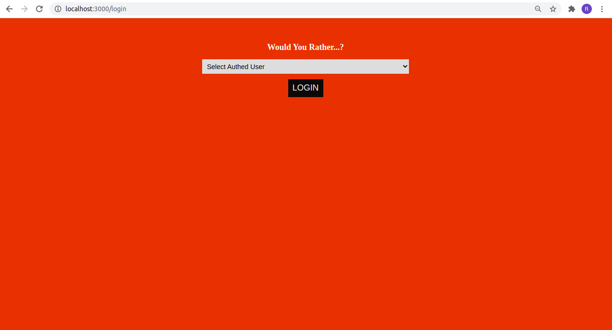
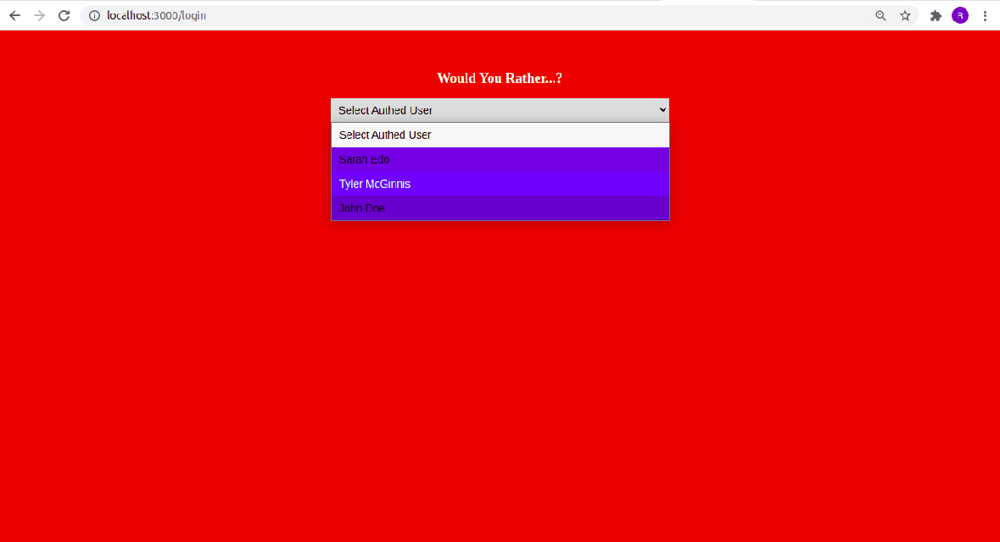
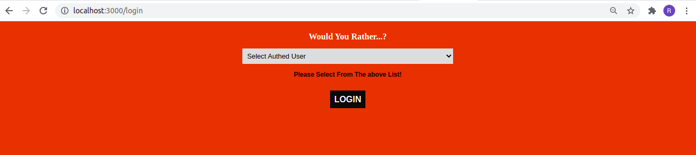
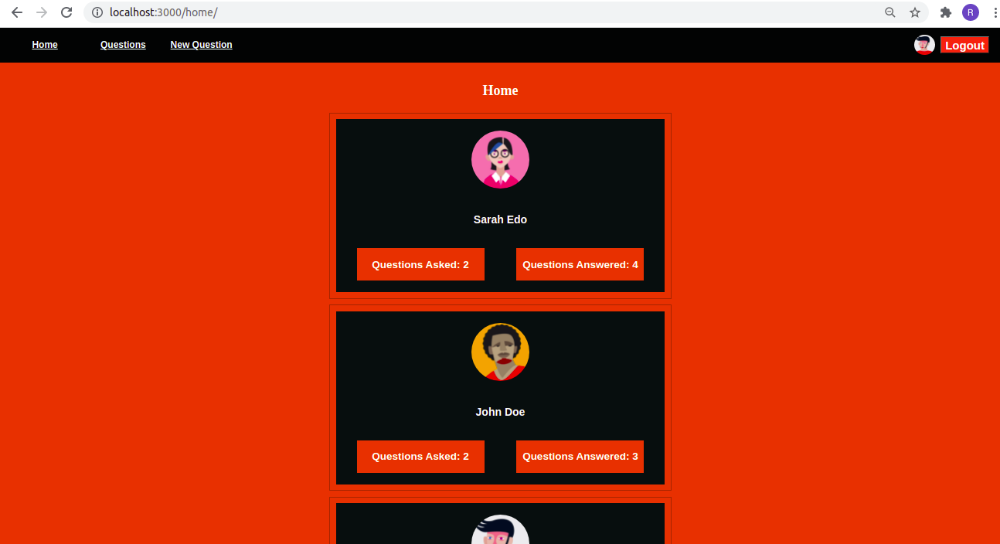
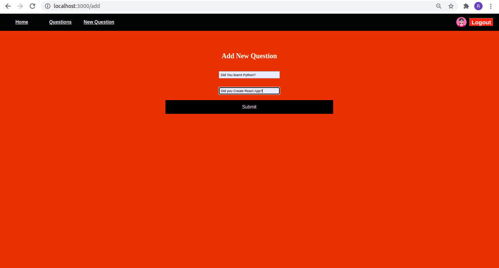
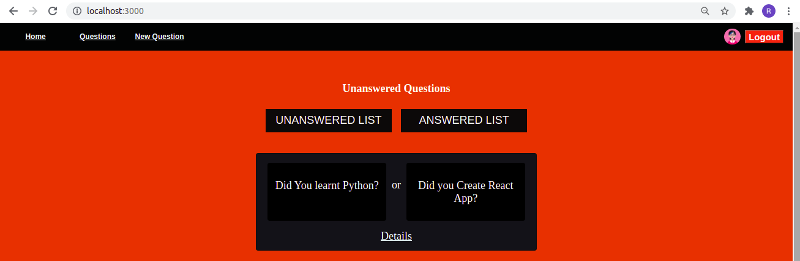
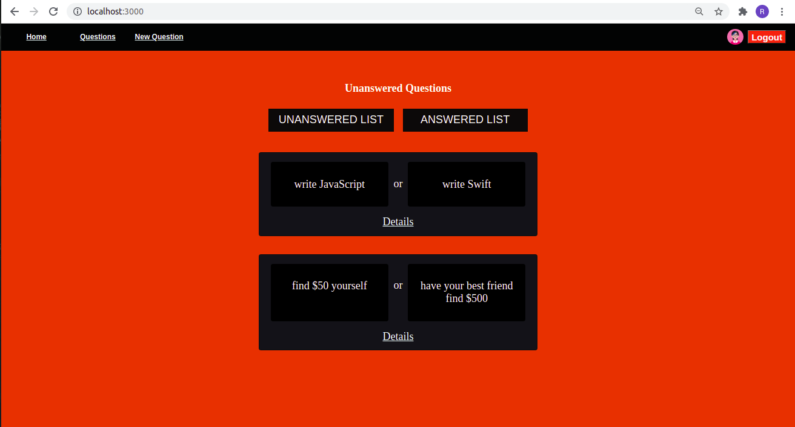
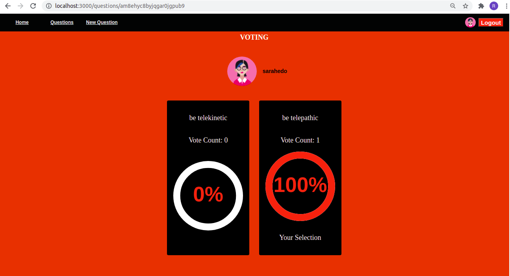

# React-Redux Would-You-Rether-App Project
In the "Would You Rather?" Project is a web app that lets a user play the “Would You Rather?” game. The game goes like this: A user is asked a question in the form: “Would you rather [option A] or [option B] ?”. Answering "neither" or "both" is against the rules.

In the app, users will be able to answer questions, see which questions they haven’t answered, see how other people have voted, post questions, and see the ranking of users on the leaderboard.


# Run the APP
download or clone the repository in your computer:
The App using Node.js for backend accourdingly you need to install it.
you can download it here: [Node.js](https://nodejs.org/en/)


Open the terminal in project directory then run the following to install all project dependencies:

### ```npm install```

To run the App:

### ```npm start```  or  ```yarn start```

How the App work

## When you run the App will see the home Page will navigate to[http://localhost:3000/](http://localhost:3000/) as below:
## If you want to login the App you need to select user from the list if you try to click on login button without selecting user you will get webpage alert as below.:



## After login the App you can find the users with the count of the questions ansewred and questions they have asked and the navbar has link of New question, questions board and logout button:


## You can add new questions as below.



## After adding a new question you will redirect to questions board to see your questions has been added.



## You Can select question to vote if you clicked daitels then click vote.



### Refrance and Documentation:
* [w3schools css3_buttons](https://www.w3schools.com/css/css3_buttons.asp)
* [Create-react-app Documentation](https://github.com/facebookincubator/create-react-app)
* [React Router Documentation](http://knowbody.github.io/react-router-docs/)
* [CircularProgressbar](https://www.npmjs.com/package/react-circular-progressbar)
* [Select option](https://stackoverflow.com/questions/29108779/how-to-get-selected-value-of-a-dropdown-menu-in-reactjs)
* [Udacity-Real-World-Redux](https://classroom.udacity.com/nanodegrees/nd019/parts/7dab5516-d1ae-45d3-b8f8-d782b5534caf/modules/ab9d8a1f-ff75-4ba7-a2aa-82cc30383710/lessons/f126db7d-157a-4b30-90de-17bd8b07208b/concepts/9371c8b3-8df8-4fc8-a511-3b21ae438261)
* [Project Rubric](https://review.udacity.com/#!/rubrics/1567/view)

